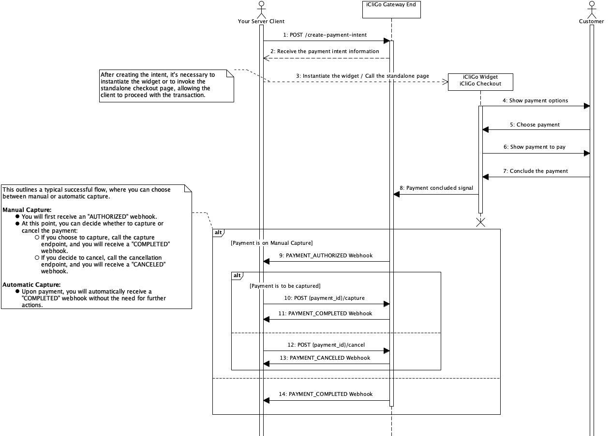

## Introduction to Payment Process Flow

This document outlines the steps involved in a typical payment transaction using the iCliGo payment gateway.

The diagram bellow represents the high-level **sequence diagram** of the payment's flow.

### Step 1: Creating a Payment Intent

The payment process begins with the creation of a **payment intent** (Step 1 in the sequence diagram). In this request, you provide key details such as the payment amount, currency, capture mode (manual or automatic), product information, the time window that the customer it is allowed to complete the payment, and any other necessary data. This request communicates your intent to initiate the transaction with the iCliGo gateway.

Once your request is received, the system processes it and responds with a status code:
- A **200 OK** response confirms that the payment intent has been successfully created, giving you the assurance that everything is correctly set up, allowing you to proceed with the next steps.
- If you receive errors such as **400, 401, or 403**, this indicates an issue with the request (e.g., missing parameters, invalid credentials), and you will need to correct it before continuing.

### Step 2: Presenting the Payment Interface

After successfully creating the payment intent, the next step is to **present the payment interface to the customer** so they can complete the transaction. At this stage, you have two options for customer interaction:

1. **iCliGo Checkout Widget**
    - You can embed iCliGo’s Checkout Widget directly on your web page (Step 3). This allows the customer to interact with the payment interface without leaving your site. The widget will handle all necessary steps, such as payment method selection and transaction confirmation, all within your branded environment. Your only responsibility is to instantiate the widget.

2. **iCliGo Checkout Standalone Page**
    - Alternatively, you can redirect the customer to iCliGo’s standalone checkout page. This is a fully hosted page managed by iCliGo, where all payment-related interactions are handled externally. The main difference is that the customer is redirected to a new URL where all checkout operations take place.

!!! note

    Regardless of whether you choose the widget or the standalone page, the customer can be redirected to a **success** or **failure** URL, as specified in the initial payment creation request.

### Step 3: Managing Customer Interactions and Webhooks

Once the customer reaches the checkout interface (via the widget or the standalone page), they will interact with the payment options (Steps 4-7). During this phase, you simply need to wait for the relevant **webhooks** that notify you of the payment’s progress, based on the customer's actions. These webhooks provide updates on key payment events:

#### Manual Capture
If you choose manual capture at the creation of payment intent, you maintain control over when the payment is finalized after the customer makes the payment. You will receive the following webhook notifications in this process:

- **PAYMENT_AUTHORIZED Webhook**: This indicates that the payment has been authorized. From here, you have two options:
    - **Cancel the payment**: If you decide to cancel the payment, it will be voided, and you'll receive:
        - **PAYMENT_CANCELED Webhook**: This confirms the payment has been successfully canceled.
    - **Capture the payment**: If you choose to capture the payment, the funds will be secured, and you'll receive:
        - **PAYMENT_COMPLETED Webhook**: This confirms that the payment has been successfully captured and completed.

#### Automatic Capture

For automatic capture, you do not need to manually control the capture process. Therefore, you will not receive a `PAYMENT_AUTHORIZED` webhook. Instead, depending on the transaction outcome, you will receive either:
- **PAYMENT_COMPLETED Webhook**: If the customer successfully completes the payment.
- **PAYMENT_CANCELED Webhook**: If the payment is canceled due to an error or expiration of the time window defined to the payment.

### Step 4: Refunding a Payment Intent

Although not represented in the sequence diagram, it is possible to request a refund for a payment intent. Refunds are only allowed for payments in the `COMPLETED` or `REFUNDED` states.

Multiple refunds are supported, but the total refunded amount cannot exceed the original captured amount. Once the first refund is processed, the payment will assume the `REFUNDED` state, which implicitly indicates a `COMPLETED` status since refunds are only allowed for completed payments, and for that reason it's possible to make another refund over a `REFUNDED` state payment.

### Summary

After creating the payment intent, your role is to choose between embedding the widget or redirecting to the standalone page to present the checkout interface. Once the customer completes their interactions with the payment UI, iCliGo will notify you of the transaction's outcome through webhooks, allowing you to take appropriate actions based on the payment’s status.

### Payment State Lifecycle

The **state machine diagram** below provides a clear view of the possible states a payment can assume in their lifecycle.

After initiating the payment, it enters the `CREATED` state. At this point, you can force a cancellation, which will move the payment to the `CANCELED` state, ending its lifecycle.

If the flow proceeds without cancellation, the payment can follow one of two paths:
- In a manual capture scenario, after the customer completes the payment, the transaction moves to the `AUTHORIZED` state. From here, you can either cancel the payment (moving it to `CANCELED`) or capture it, transitioning the payment to the `COMPLETED` state.
- In an automatic capture scenario, the payment will bypass the `AUTHORIZED` state and move directly to `COMPLETED` upon successful payment.

Once the payment reaches the `COMPLETED` state, it can be refunded, transitioning it to the `REFUNDED` state. In either case, the payment has reached a final state.
