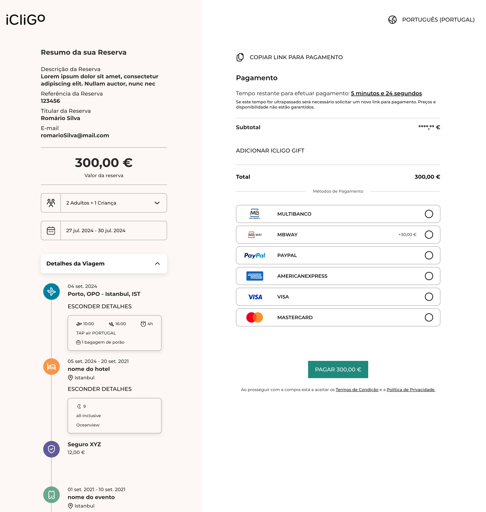

# **Payment Gateway Widget**

Documentation for iCliGo’s payment platform.

There are two ways to present the payment interface:

1. Widget
2. External Page

## **Prerequisite**

To initiate a payment, a payment intent (***paymentId***) must be created beforehand.

In this documentation, we will use the following session as an example.

```jsx
const paymentId = 'f283a5e8-87fd-40cd-b506-c58ff3e0d6d4';
```

## **Widget Mode**

Use the widget mode to embed the form into an existing page.

### **Assets**

CSS and Script to include in the html page.

```html
<!-- Widget styles -->
<link
  rel="stylesheet"
  href="https://staging.icligo.com/payment-gateway/widgets/styles/style.css"
  data-asset-type="stylesheet" />

<!-- Widget library -->
<script
  type="application/javascript"
  src="https://staging.icligo.com/payment-gateway/widgets/index.umd.js"></script>
```

### **Initialise Widget**

To initialise the Widget, include the assets defined above and:

1. Include the HTML element where the widget is loaded (container).

    ```html
    <!-- Widget container -->
    <icligo-widget-app data-widget="payment-form"></icligo-widget-app>
    ```

    **Attributes**

    | Attribute           | Required | Description       |
    |---------------------|----------|-------------------|
    | ***`data-widget`*** | *true*   | Unique element ID |

2. Execute function ***PaymentForm*** (***window.iCligoPaymentGateway.widgets.PaymentForm***)

    ```html
    <!-- Start Widget -->
    <script type="application/javascript">
      ((widget) => {
        const props = {
          paymentId: 'f283a5e8-87fd-40cd-b506-c58ff3e0d6d4',
          options: {
            locale: 'pt',
            showCopyButton: true,
            vouchers: true
          },
          callbacks: {
            onFinish: (data) => {
              console.log('onFinish', data);
              window.location.href = '/success.html';
            }
          }
        };
        widget('payment-form', props);
      })(window.iCligoPaymentGateway.widgets.PaymentForm);
    </script>
    ```

    ***PaymentForm Args***
   
    ```javascript
    window.iCligoPaymentGateway.widgets.PaymentForm(containerId, props)
    ```
   
    | Arg                                  | Type                          | Required | Default | Description                                                                                              |
    |--------------------------------------|-------------------------------|----------|---------|----------------------------------------------------------------------------------------------------------|
    | ***`containerId`***                  | *string*                      | *true*   |         | ID defined on HTML element attribute (`data-widget`)                                                     |
    | ***`props`***                        | *object*                      | true     |         | Widget Props                                                                                             |
    | ***`props.paymentId`***              | *string*                      | *true*   |         | Payment intent ID                                                                                        |
    | ***`props.options`***                | *object*                      | *false*  |         | Widget options                                                                                           |
    | ***`props.options.locale`***         | *Enum* <br/> `"pt","en","es"` | *false*  | `"pt"`  | Widget locale definitions                                                                                |
    | ***`props.options.showCopyButton`*** | *boolean*                     | *false*  | `true`  | Show button ‘copy payment link’                                                                          |
    | ***`props.options.vouchers`***       | *boolean*                     | *false*  | `true`  | Show voucher’s section                                                                                   |
    | ***`props.callbacks`***              | *object*                      | *false*  |         | Widget Callbacks                                                                                         |
    | ***`props.callbacks.onFinish`***     | *(data) => void*              | *false*  |         | Function invoked after successful payment message (OK Button).<br/>Can be used to redirect to a new URL. |

### **Widget Example**

```html
<!doctype html>
<html lang="pt">
  <head>
    <meta charset="UTF-8" />
    <link rel="icon" type="image/x-icon" href="https://staging.icligo.com/payment-gateway/favicon.ico" />
    <meta name="viewport" content="width=device-width, initial-scale=1.0" />
    <title>iCliGo Payment Widget Demo</title>

    <!-- Widget styles -->
    <link
      rel="stylesheet"
      href="https://staging.icligo.com/payment-gateway/widgets/styles/style.css"
      data-asset-type="stylesheet" />
    <!-- Widget library -->
    <script
      type="application/javascript"
      src="https://staging.icligo.com/payment-gateway/widgets/index.umd.js"></script>
  </head>
  <body>
    <div style="max-width: 768px; margin: 0 auto">
      <!-- Widget container -->
      <icligo-widget-app data-widget="payment-form"></icligo-widget-app>
    </div>

    <!-- Start Widget -->
    <script type="application/javascript">
      ((widget) => {
        const props = {
          paymentId: 'f283a5e8-87fd-40cd-b506-c58ff3e0d6d4',
          options: {
            locale: 'pt',
            showCopyButton: true,
            vouchers: true
          },
          callbacks: {
            onFinish: (data) => {
              console.log('onFinish', data);
              window.location.href = '/success.html';
            }
          }
        };
        widget('payment-form', props);
      })(window.iCligoPaymentGateway.widgets.PaymentForm);
    </script>
  </body>
</html>
```

{ width="580" }

## **External Page (full page url)**

Open the platform on a new page.

### **URL address**

```html
https://staging.icligo.com/payment-gateway/${locale}?payment=${paymentId}&enableCopy=true&enableVouchers=true
```

### **URL Paths**

| Attribute      | Required | Default | Description                                     |
|----------------|----------|---------|-------------------------------------------------|
| ***`locale`*** | *false*  | `"pt"`  | Page locale definitions. Enum: `"pt","en","es"` |

### **URL Params**

| Attribute              | Required | Default | Description                     |
|------------------------|----------|---------|---------------------------------|
| ***`payment`***        | *true*   |         | Payment intent ID               |
| ***`enableCopy`***     | *false*  | *true*  | Show button ‘copy payment link’ |
| ***`enableVouchers`*** | *false*  | *true*  | Show voucher’s section          |

{ width="768" }
